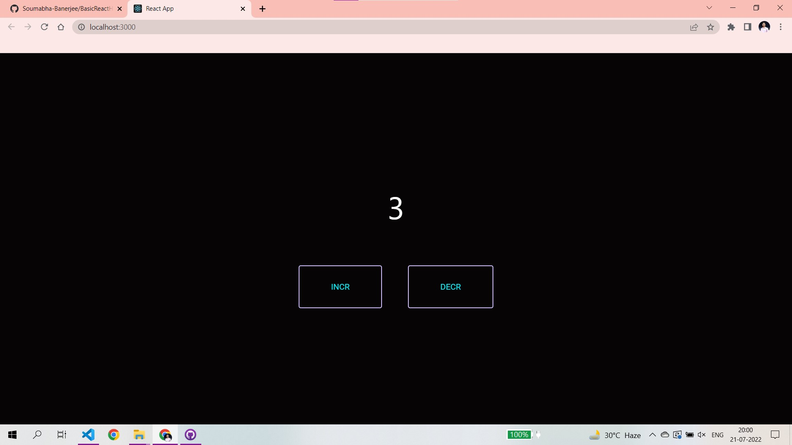
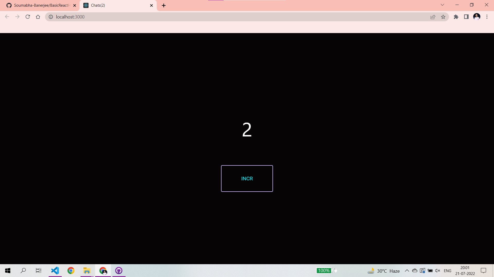

# BasicReactHooks
This is an example of basic react hooks. UseState, UseEffect &amp; UseReducer is covered here. This website simply increment &amp; decrement a counter which is basically the state of the page &amp; shows the current state on the title using useEffect.

